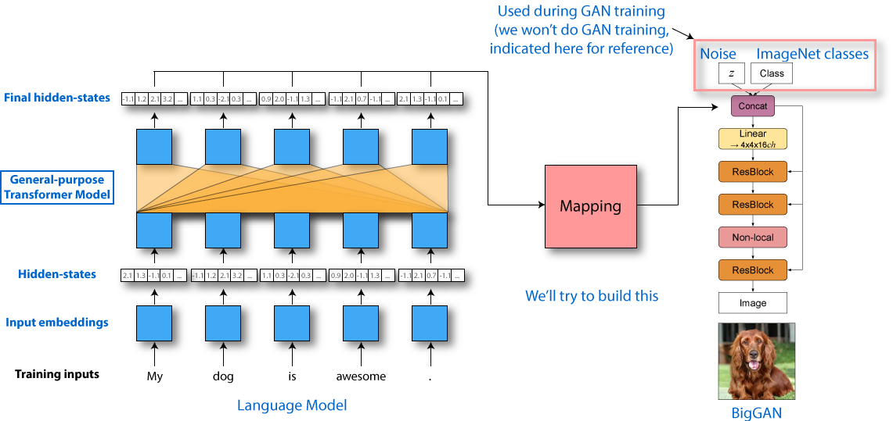

# 🤗Hugging Face ML researcher/engineer code exercise - Funky mutli-modal version

## Philosophy of the exercice and disclaimer

This is a rather **open** code exercise, closer to a small research project than your usual code exercise.
There is no gold answer and hopefully no ready-to-copy answers on the web as well. Try to spend ~ 3 hours on it.

The focus of the project is mostly to build a quick proof-of-concept for an idea. As such the usual steps of evaluation and metric computation can be skiped in this project even though you would like to have them in a typical, longer than 3 hours, project.

The submitted result for this code exercice can range from:

- a notebook with pieces of code and some comments,
- a list of the problems you met while doing the exercice and how you tackle some of them.
- a full code base with a running demo and finished examples.

What we want to see is whether you:

- have a good and hands-on knowledge of python,
- have a good and hands-on understanding of at least one deep learning framework between PyTorch and TensorFlow,
- have a good and hands-on knowledge of how neural network models are trained and used, and
- have some interest in funky projects and are autonomous enough to navigate in an open-field of close-to-research projects.

## Introduction

Natural language understanding models have been trending recently. In parallel, there is exciting work on image generation, traditionally using GANs or likelihood-based methods. Combining text and image is usually done by using a classifier model trained on parallel images and text inputs for join multi-modal reasoning. Typical recent examples are the [following](http://arxiv.org/abs/1908.06938) [works](http://arxiv.org/abs/1909.02950) (not necessary to read them for the present exercise).

In this exercise, we'll take a different approach. We want to see if a good language understanding model (like Bert) can be combined with a good image generation model (like BigGAN) to **generate good quality images from text** end-to-end in a creative proof-of-concept application.

Here is the target workflow:

- the user input some text, e.g. "I have a cat",
- a pretrained language model (e.g. DistilBERT) converts the text in contextualized hidden-states embeddings
- a mapping model (that you will build in the exercise) converts the contextualized hidden-states embeddings in a input vector for a pretrained image generation model (BigGAN)
- the pretrained image generation model converts the input vector in an image, hopefully the image of a cat.

Here is an illustration of what we are trying to build:



References for BERT and BigGAN, if you haven't read these papers:

- The [BERT paper](http://arxiv.org/abs/1810.04805)
- The [BigGan paper](https://openreview.net/forum?id=B1xsqj09Fm)

The time to read these papers is not comprised in the timing of the current coding exercise. BERT paper is an essential paper in today's NLP, so read it anyway. Reading the BigGAN paper is optional, we reproduce the main necessary elements below (but it's an interesting paper nonetheless).

Training a good text understanding and a good image generation model is very expensive so we want to start from pretrained models: a pretrained language model (like Bert or GPT-2) and a pretrained image generation model like BigGAN.

Moreover, the discriminator of BigGAN was not released so we can't really train or finetune this model. We will assume BigGAN is a static model in the following and don't expect you to train or finetune it.

## Some words on BigGAN

A generative adversarial model (GAN), like BigGAN, is usually trained on ImageNet generate an image from a set of inputs consisting of:

- a noise vector (of length 128 for BigGAN), typically randomly initialized for each sample from a truncated normal distribution, and
- a one-hot class vector (of length 1000) indicating which of the 1000 classes of ImageNet the image should be generated for.

The first step of BigGAN's forward pass is to convert the one-hot 1000-dim class vector in a dense class vector (of length 128) representing the associated ImageNet class using an embedding projection matrix similar to a typical word embedding matrix.

The noise vector and the dense class embedding are then concatenated in a single input vector of length 256 which is used for the image generation process.

We reproduce the forward pass of BigGAN from [here](https://github.com/huggingface/pytorch-pretrained-BigGAN/blob/master/pytorch_pretrained_biggan/model.py#L289) to illustrated this:

```python
def forward(self, noise, class_one_hot_label, truncation):
    """ inputs:
            - noise: vector of shape (batch size, 128)
            - class_one_hot_label: vector of shape (batch size, 1000)
            - truncation: a float as hyper-parameter (not important for us, for details see BigGAN paper)
        Outputs:
            - output_image: an image of shape (batch size, 3, XXX, XXX)
                where XXX is the resolution of the BigGAN checkpoint used (128, 256 or 512)
    """
    class_embed = self.embeddings(class_one_hot_label)  # shape (batch size, 128)
    input_vector = torch.cat((noise, class_embed), dim=1)  # shape (batch size, 256)

    output_image = self.generator(input_vector, truncation)
    return output_image
```

## Some words on aligning latent spaces

As we can see we basically have two latent spaces that were trained separately:

- BERT embeddings which are in a 768-dimensions latent space and are associated to text tokens
- BigGAN embeddings which are in a 128-dimensions latent space and are associated to each ImageNet class (the noise vectors don't really have usable information content).

We would like to build a mapping between these two embedding spaces to connect the two models in a relevant way so that a text input like "I have a cat" would generate the image of a cat.

Learning a mapping between two independently learned latent spaces has been investigated in fields like unsupervised machine translation. A logical solution, first proposed by [Mikilov et al. in 2013](https://arxiv.org/abs/1309.4168), involves learning a mapping between both embedding spaces learned from a set of seed points mapping one space to the other.

We'll use the ImageNet classes as a database to generate seed mapping points between our two models. In our case we can see that:

- on the one hand, each ImageNet class can be associated to one (or several) text label(s) like "cat", "dog", "car" and so on,
- on the other hand, our pretrained langage model can generate hidden-states from provided sentences containing these words, for instance "I have a cat", "My dog is barking" or "This car was driving fast".

From these two associated sets of text inputs we can thus:

- manually create a dictionnary of text sentences associated to each ImageNet class,
- extract embeddings associated to both, by computing BERT's output as inputs `Xi` for our mapping function and extracting the relevant ImageNet dense class vector `Zi` from BigGAN's input embedding matrix as target.
- use this seed dictionnary of associated `Xi` and `Zi` to learn a mapping function from the language model hidden-states to relevant input vectors for BigGAN.

Obviously, the generalization of such a procedure on random text outside of the fine-tuning distribution of seed sentence, or outside of the ImageNet training classes, will not be garanted and the multi-model systems will probably generate more unpredictable images.

## Code exercice

The coding exercise can be done in either `PyTorch` or `TensorFlow 2.0` (maybe also possible in TF 1.0, but you'll have to find the right tools and repositories) and should be done in `python`.

You should use as starting points:

- a PyTorch or TF 2.0 version of a pretrained language model, for instance, as provided in the [Transformers library](https://github.com/huggingface/transformers), and
- a PyTorch (TF 2.0 version is being finalized) of a pretrained BigGan model, for instance as provided in the [pretrained-biggan library](https://github.com/huggingface/pytorch-pretrained-BigGAN). You can also use the TF 1.0 version provided on tf.hub and extract the relevant variables (embeddings of the GAN).

The provided utility scripts in this repo are currently provided for PyTorch only. They are very simple and mostly provided for demo/data generation (see below).

Once you've briefly seen how these repositories are organized, the first step is to build a dataset of input-output for learning the mapping between the language model output hidden-states and the ImageNet classes embeddings of the GAN.

### Building a dataset of text sequence associated to ImageNet classes

We provide a simple script ([prepare_data.py](./prepare_data.py)) that will generate a list of sentences for a set of ImageNet classes using a very simple heuristic with patterns. For instance an ImageNet class with a image of a dig will be associated with a sentence 'I saw a dig'.

See this file for more details on the filtering and heuristics involved.

You can use (and modify as needed) this script to generate a first dataset.

**Code exercise output**:

- List some improvements you would propose to improve this data generation process.

### Building a dataset for training a mapping function

From the previous text dataset you can now generate a dataset that can be used to train a mapping function from a language model output to an input vector for BigGAN.

For instance you can follow the following path:

- Generate input vectors from outputs from a pretrained language model for all the examples,
- Generate target vectors by extracting associated target class embeddings from BigGAN's input embedding matrix (see the above `forward` pass code).

**Code exercise output**:

- Create the dataset for training the mapping function
- List some improvements or alternative that could be explored to improve this step.

### Learning a mapping function

Now you can train a mapping function from the output of the language model to the input of the generative adversarial network.

You can try various mapping function, from simple linear projection to more complexe functions.

In general, the expected interface of the mapping function is:

- input: a vector of shape (sequence length, language model hidden-size), for ex (sequence length, 768) for a DistilBERT language model.
- output: a vector of shape (GAN model hidden-size,), i.e. (128,) for BigGAN.

### Demo

The end goal of the exercise is to use the model at inference time, for instance by generating an image of a cat when inputting a sentence like "I love my cat".

We provide in the [`run_model.py`](./run_model.py) script a few utilities you can use to generate picture from text if your mapping function follow the expected interface mentioned above.

Overall, please bear in mind that:

- we don't require you to finish the exercise, sending back work-in-progress is expected, and
- the model might not work entirely as intended in the end. This is also fine since the project itself is closer to a research project than a regular code-exercise.

Good luck! 🤗🤗🤗
